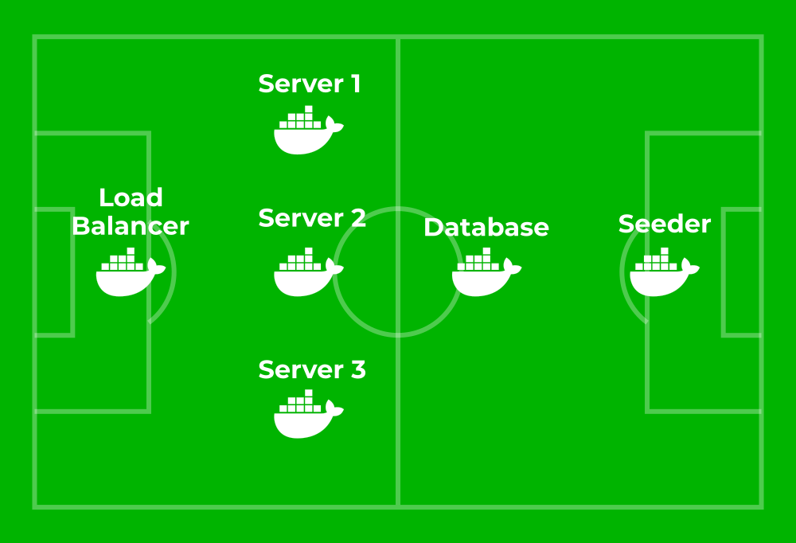

# Football App

Elixir application that serves the football results included in the `priv/Data.csv` file.

## Architecture



**Football App** is composed of 6 containers.

The **load balancer** container accepts requests on port 80 and sends them to one of the 3 app servers.
This component uses HAProxy.
The code for this component is in the `football_app_load_balancer` folder.

The 3 **app server** containers use the same Docker image.
This image includes an Elixir project that uses the [cowboy](https://hex.pm/packages/cowboy) HTTP server to expose an HTTP API.
The app server receives requests from the load balancer and queries the database to build the responses.
The app server uses the [exprotobuf](https://hex.pm/packages/exprotobuf) package to encode Protocol Buffer responses.
The code for this component is in the `football_app_server` folder.

The **database** container consists of a PostgreSQL server running on port 5432.

The **seeder** container uses the same Docker image as the app servers.
The difference is that instead of running an HTTP server, this container will seed the database and stop automatically when finished.

## API Documentation

API documentation is available in [docs/api.md](https://github.com/pivanlo/football-app/blob/master/docs/api.md).

## Running the application

Make sure you have Docker and Docker Compose installed and operational.

Move to the root directory and start the application with:

```
docker-compose up
```

This command will start the 6 containers.
The seeder container will seed the database and then stop.

Port 80 of the load balancer container is mapped to port 80 of the Docker host.

You can send requests to `http://localhost/api` from the Docker host.
For example: `http://localhost/api/leagues`.
Also, you can check the health of the app servers here: `http://localhost/haproxy?stats`.

## Running tests

Move to the `football_app_server` folder.

Start a database container with:

`docker run --name football-app-db -p 5432:5432 -e POSTGRES_DB=football_app -e POSTGRES_PASSWORD=postgres -d postgres`

Export the following environment variables:

```
export FOOTBALL_APP_DB=football_app
export FOOTBALL_APP_DB_HOSTNAME=172.0.0.13
export FOOTBALL_APP_DB_USERNAME=postgres
export FOOTBALL_APP_DB_PASSWORD=postgres
```

Run the tests with:

```
mit test
```

## Connecting to the database

Port 5432 of the database container is mapped to port 5432 of the Docker host.

If you have psql installed in your Docker host, you can connect to the database with:

```
PGPASSWORD="postgres" psql -h localhost -p 5432 -U postgres
```
